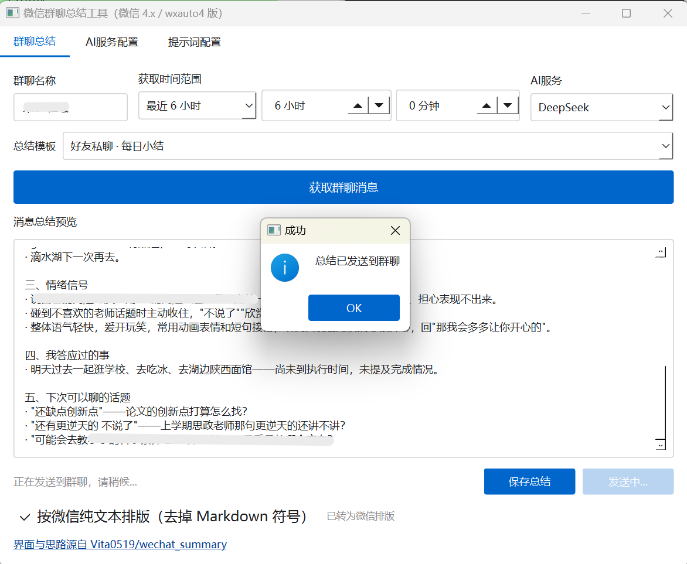

<div align="center">

# 微信群聊总结助手

**本工具把数量庞大、难以逐条阅读的微信群聊记录，交由人工智能整理成一份可以直接发送回群聊的结构化总结。**

本版本适配微信 4.x 客户端与 wxauto4 自动化库，它提供了图形界面，并且全程只操作用户本机已经登录的微信客户端。

[](https://github.com/Golden2002/wechat-summary-assistant/stargazers)
[](https://github.com/Golden2002/wechat-summary-assistant/commits)
[](#环境要求)
[](#环境要求)
[](#许可与免责)

</div>

---

## 本工具要解决的问题

微信群聊的消息刷新速度很快。用户若有一天没有查看，群内往往就已经积累了几百条消息，重要的信息很容易被淹没；而事后想要回头逐条翻阅，又几乎不可能把整个时间范围完整地读完。

本工具按照下列步骤完成工作：

1. 它从用户本人已经登录的微信桌面客户端中，读取指定会话在指定时间范围内的聊天记录；
2. 它把聊天记录提交给 DeepSeek、Kimi、通义千问等任意兼容 OpenAI 接口的服务，由该服务生成结构化的总结；
3. 它把总结结果转换为微信能够正常显示的纯文本格式，用户可以将其直接发送回群聊，也可以保存为本地文件。

整个过程通过 Windows UI 自动化技术实现。本工具不涉及通信协议破解，不注入任何代码，也不修改微信的客户端文件。

---

## 界面预览



上图展示的是「群聊总结」标签页。窗口上方依次排列着群聊名称、获取时间范围、AI 服务与总结模板四项输入控件；窗口中部是消息总结的预览区域，其中显示了一份依据「好友私聊 · 每日小结」模板生成的总结；窗口下方是保存与发送按钮，以及控制输出格式的复选框。画面中央的提示框表明，本次生成的总结已经成功发送到目标群聊。

---

## 主要特性

- 🔍 **本工具能够完整覆盖用户所选定的时间范围**：原版实现由于所依赖的 wxauto4 免费版缺失内部方法，只能读取当前屏幕上的少量消息；本版把消息读取层重写为滚动收集引擎，在同一批测试数据上，可读取的消息数量由 7 条提升至 95 条。
- 🧩 **本工具内置 18 套场景化的提示词模板**：这些模板覆盖了通用、私人社交、工作协作、学习与行业、社区与运营五类场景；每一套模板都写入了“仅依据聊天记录、不得编造、缺失信息标注为『记录中未提及』”等事实性约束。
- 🧹 **本工具会自动移除 Markdown 标记**：微信聊天窗口并不渲染 Markdown，因此本工具会把模型输出转换为纯文本，并且使用【标题】一类的记号来组织层次；预览区域所显示的内容，与最终发送出去的内容完全一致。
- ⏱️ **本工具支持灵活的时间范围选择**：它既支持相对时间（最近 30 分钟至最近 30 天），也支持绝对时间（今天 00:00 起、昨天 00:00 起、本周一 00:00 起，以及自定义的起止时刻）。
- 🛑 **用户可以在任务执行到一半时将其中止**：抓取一个消息量较大的群聊可能需要十几分钟，此时用户可以按 Esc 键、按空格键，或者点击「中止」按钮来停止当前任务。
- 🔌 **本工具内置 12 家 AI 服务的预设**：用户可以手动输入模型名称，也可以用一键操作拉取所选服务当前真实可用的模型清单。
- 🧠 **本工具针对模型幻觉做了专门的设计**：它要求模型不得猜测 [图片]、[语音] 一类占位符的具体内容，并且防范提示词注入、对隐私信息进行脱敏、在某个小节没有内容时把该小节的标题一并省略。
- 🧪 **本项目配备了四套离线测试**：这些测试用一个“只能看到当前屏幕”的模拟微信对象，覆盖了抓取引擎的全部关键假设。

---

## 快速开始

本工具需要 Python 3.12 与微信 4.x 桌面客户端。请依次完成下列步骤：

1. 双击 `install.bat`。该脚本会自动完成三件事：创建虚拟环境、安装依赖项、运行环境自检。
2. 双击 `run.bat`，启动图形界面。
3. 在「AI服务配置」标签页中，填入任意一家服务的 API Key。
4. 回到「群聊总结」标签页，在群聊名称一栏中先填入 **文件传输助手**（该会话仅属于用户本人，最为安全）。
5. 选择需要整理的时间范围，点击「获取群聊消息」；待总结生成之后，即可选择「保存总结」或者「发送到群聊」。

如果希望手动完成安装，请依次执行下列命令：

```bat
py -3.12 -m venv .venv
.venv\Scripts\python.exe -m pip install -r requirements.txt
```

> ⚠️ 请务必注意 Python 的版本。`wxauto4` 要求 Python 的版本低于 3.14，因此 **Python 3.14 无法安装本工具所依赖的库**。

---

## 输出格式示例

模型输出的是 Markdown 文本，而微信只接受纯文本。这一层转换由本工具自动完成，无需用户干预。

<table>
<tr><th>模型输出的原始文本</th><th>发送到微信之后的显示效果</th></tr>
<tr><td>

```markdown
# 今日纪要

**结论**：方案 A 通过。

## 待办
- [ ] 张三：提交 PR
- [x] 李四：更新文档

| 风险 | 等级 |
| --- | --- |
| 排期紧 | 高 |

> 周五前完成。
```

</td><td>

```text
【今日纪要】

结论：方案 A 通过。

【待办】
☐ 张三：提交 PR
☑ 李四：更新文档

· 排期紧：高

｜ 周五前完成。
```

</td></tr>
</table>

---

## 文档索引

| 文档 | 主要内容 |
| --- | --- |
| [docs/USAGE.md](docs/USAGE.md) | 安装步骤、AI 服务与模型配置、时间范围、18 套模板、输出格式、任务中止、命令行用法 |
| [docs/TROUBLESHOOTING.md](docs/TROUBLESHOOTING.md) | 实测记录与故障排查：连接失败、消息读取不全、抓取速度偏慢、兼容性矩阵 |
| [docs/TECHNICAL.md](docs/TECHNICAL.md) | 技术说明：整体架构、抓取引擎、中止机制、提示词系统、文本转换器、测试策略 |
| [docs/ATTRIBUTION.md](docs/ATTRIBUTION.md) | 来源与致谢：原始项目、所依赖的库、参考资料 |
| [docs/provider-api-research-2026-09-17.md](docs/provider-api-research-2026-09-17.md) | 12 家服务与模型清单的调研记录，其中包含已下线模型的名单与各项结论的来源 |

---

## 项目结构

```
wechat_summary/
├─ wechat_summary_gui.py        图形界面入口（双击 run.bat 时所运行的文件）
├─ wechat_summary.py            核心逻辑：抓取消息、拼装提示词、调用模型、保存与发送
├─ prompt_presets.py            18 套内置提示词模板（纯数据模块，修改文案时无需改动逻辑）
├─ wechat_text.py               Markdown 到微信纯文本的转换器（自带测试用例）
├─ wechat_uia_wake.py           微信 4.1 及以上版本的无障碍闸门热激活（可自动修复，也可独立使用）
├─ check_env.py                 环境自检脚本（使用 --live 参数时实际连接一次微信）
├─ tests/                       四套离线测试（运行时不需要微信处于运行状态）
├─ tools/collect_probe.py       真机抓取验证（不调用 AI，也不发送任何消息）
├─ tools/publish_to_github.ps1  向 GitHub 发布当前提交（通过 API 完成，适用于 github.com 无法访问的网络环境）
└─ docs/                        使用、排障、技术、来源与调研五类文档，以及界面截图
```

---

## 环境要求

| 项目 | 要求 |
| --- | --- |
| 操作系统 | Windows 10 或 Windows 11。wxauto 基于 Windows UI Automation 实现，因此**不支持** Linux 与 macOS |
| Python | 3.9 至 3.13，推荐使用 3.12；**Python 3.14 不可用** |
| 微信 | 微信 4.x 桌面客户端，并且已经在本人的账号下正常登录 |

完整的兼容性矩阵（包含微信各个版本以及 Plus 版的差异）见
[docs/TROUBLESHOOTING.md 第 6 节](docs/TROUBLESHOOTING.md#6-兼容性矩阵)。

---

## 常见问题

<details>
<summary><b>工具提示「未找到已登录的客户端主窗口」，应当如何处理？</b></summary>

首先需要澄清一个常见的误解：**微信的主窗口处于最小化状态并不是故障的原因**，这一点已经经过实测确认。真正的原因几乎总是微信 4.1 及以上版本的「无障碍闸门」没有被激活。这并非微信版本过新所导致的问题，因此**不需要**为此降级微信客户端。

本工具会自动热激活该闸门，并重试连接。在通常情况下，用户无需进行任何操作。若需要手动诊断，可以执行下列命令：

```bat
.venv\Scripts\python.exe wechat_uia_wake.py status
.venv\Scripts\python.exe wechat_uia_wake.py wake
```

详细的排查过程见 [docs/TROUBLESHOOTING.md 第 1 节](docs/TROUBLESHOOTING.md#1-连接失败未找到已登录的客户端主窗口)。

</details>

<details>
<summary><b>工具只总结出很少的几条消息，应当如何处理？</b></summary>

这是原版实现中一个已知的缺陷：wxauto4 免费版所提供的 `LoadMoreCache` 方法在内部调用了一个并不存在的方法，导致翻页过程在第一轮就中断了。本版已经针对这一层做了完整重写，改用了滚动收集引擎。

如果仍然觉得读取到的消息偏少，可以依次检查下列几点：确认微信窗口没有被最小化；尽量把微信窗口调高，因为窗口的高度直接决定了一屏能够容纳的消息条数；把获取的时间范围调小一些。抓取的速度上限约为每秒 0.5 至 1 条消息，这一上限由微信客户端决定，与所选用的模型无关。日志中会明确记录是否覆盖到了时间范围的起点。

详细的说明见 [docs/TROUBLESHOOTING.md 第 2 节](docs/TROUBLESHOOTING.md#2-消息读不全--只拿到当前页面几条)。

</details>

<details>
<summary><b>抓取的速度偏慢，能否在任务执行到一半时停下来？</b></summary>

可以。用户可以按 **Esc** 键，或者按 **空格** 键，也可以点击界面上的「**中止**」按钮（在点击该按钮之前，用户需要先把本工具的窗口切换回前台）。中止过程采用协作式的方式实现，因此按下之后最多还需要等待约十秒钟。

</details>

<details>
<summary><b>执行 <code>pip install</code> 时报告 <code>No matching distribution found</code>，应当如何处理？</b></summary>

出现该错误的原因多半是 Python 的版本为 3.14。`wxauto4` 的元数据中声明了 `Requires-Python: <3.14,>=3.9`，因此请改用 Python 3.12。

</details>

<details>
<summary><b>生成的总结中仍然出现了 <code>#</code> 与 <code>**</code>，应当如何处理？</b></summary>

请查看预览区域右侧的提示信息，它会列出仍然残留的语法类别（例如「标题」「表格」）。这种情况说明转换器尚未覆盖到某一种新的语法，欢迎提交 issue，并在其中附上模型的原始输出。

</details>

其余问题请查阅 [docs/TROUBLESHOOTING.md](docs/TROUBLESHOOTING.md)。

---

## 关于代码注释的说明

本项目所依赖的东西当中，有一项是**会不断变化的用户界面**：微信客户端每次更新，都有可能使原本可用的自动化方案失效。因此，本项目在实现时做出了下列取舍：

- 把**每一条实测结论**都写进代码注释与文档之中，例如“为什么选用 `{PageUp}` 键而不选用 `{End}` 键”，以及“为什么不能使用 `msg.id` 去重”，而不是仅仅注明“这样写可以运行”；
- 用一个**模拟的微信对象**把抓取引擎的关键假设固化成测试用例，使得后续修改代码时能够立刻发现假设是否已经被破坏；
- 在遇到厂商接口发生变化时（例如模型下线、`GET /models` 并非普遍可用），**把已经下线的名称写进注释与界面提示之中**，以免后来者重复踩到同一个问题。

具体的实现细节见 [docs/TECHNICAL.md](docs/TECHNICAL.md)。

---

## 参与贡献

欢迎提交 Issue 与 Pull Request。在修改代码之前，建议先运行一遍离线测试：

```bat
.venv\Scripts\python.exe wechat_text.py
.venv\Scripts\python.exe tests\test_core.py
.venv\Scripts\python.exe tests\test_gui_smoke_v2.py
```

如果所作的修改涉及消息抓取层，请一并附上 `tools/collect_probe.py` 的输出结果。

---

## 致谢

本项目是一个**二次开发的版本**。它的界面设计、交互结构以及部分提示词，沿用了
[Vita0519/wechat_summary](https://github.com/Vita0519/wechat_summary)（即原始项目）。

- **[wxauto4](https://pypi.org/project/wxauto4/)**（作者为 Cluic）：本工具所依赖的微信 UI 自动化库。
- **[wechatauto-replica](https://github.com/fanyuantaier/wechatauto-replica)** 等社区实测文章：无障碍闸门热激活方案的来源。
- OpenAI Python SDK、Qt for Python (PySide6)、loguru：本项目所依赖的开源库。

完整的来源清单、沿用范围与依赖致谢，见 **[docs/ATTRIBUTION.md](docs/ATTRIBUTION.md)**。

---

## 许可与免责

- 本工具**仅可供学习与技术研究使用**，不得用于任何商业用途或非法用途。
- 原始项目**没有提供独立的 LICENSE 文件**，因此本版**不主张任何独立的授权**，并且按照原始项目 README 中“仅供学习和技术研究使用”的声明精神继续沿用。**如需商业使用或者再分发，请先与原作者联系并取得授权。**
- 本工具与腾讯公司、微信官方**没有任何隶属关系，也没有获得其授权**，它并不是官方软件。
- 使用者应当只操作**本人有权控制的**设备、账号与会话，应当遵守微信的服务协议，不得将其用于批量营销、骚扰或者任何违法的用途。使用第三方自动化工具操作微信**有可能触发风控**，请保持低频使用，并且先用「文件传输助手」进行测试。
- 作者不对本工具的安全性、完整性、可靠性、有效性、正确性或者适用性作任何明示或者默示的保证，也不对使用或者滥用本工具所造成的任何直接或间接损失承担责任。微信 4.x 客户端更新频繁，本版不对持续兼容性作任何承诺。

另请参见 [wxauto 可接受使用政策](https://docs.wxauto.org/legal/acceptable-use)。
